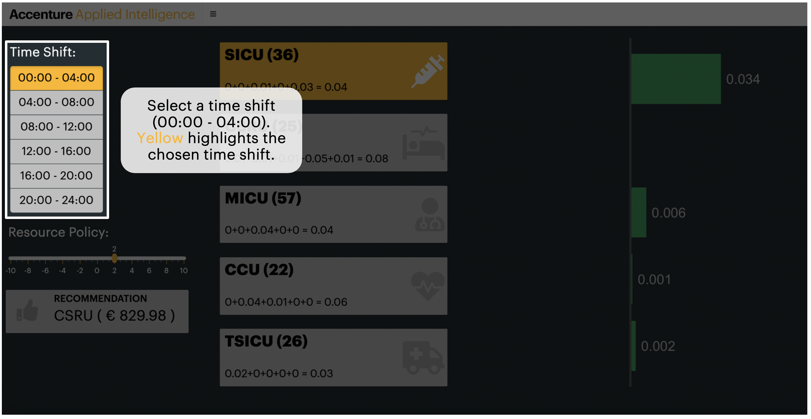
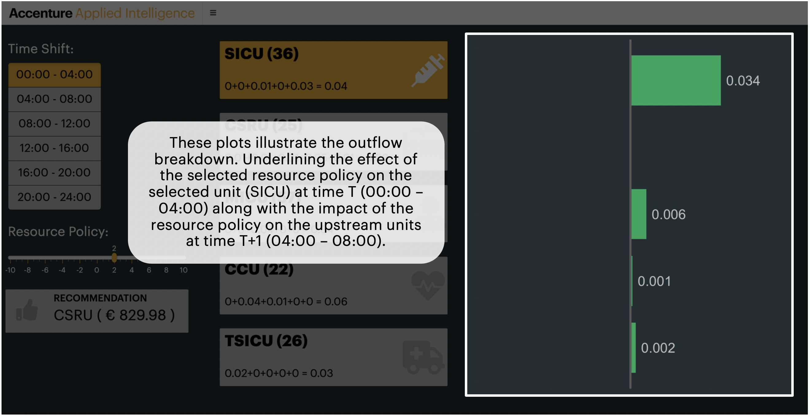

# Bayesian Hospital - Documentation
## Barcelona GSE Data Science Center
### Omiros Papaspiliopoulos, Aleix Ruiz de Villa, Reid Falconer, Max Zebhauser and Nandan Rao

# Platform

We have used BigQuery from Google Cloud Platform to manage and process MIMIC's data. Some links that may be useful

- MIMIC's documentation: https://mimic.physionet.org/
- MIMIC's databse schema https://mit-lcp.github.io/mimic-schema-spy/
- Code repository: https://github.com/MIT-LCP/mimic-code
- Visualization tool: http://hdsl.uwaterloo.ca/visualization-tool/

# Uploading data to Big Query

The best way to upload data si following step by step the tutorial from MIMIC' github repository 
https://github.com/MIT-LCP/mimic-code/tree/master/buildmimic/bigquery.  

Call your BQ Dataset **MIMIC3\_V1\_4** so that the rest of the scripts are compatible.

# Connect to BigQuery via R

For this you can use the `BQ connection example.R` file. First time you use it, it asks you for your google authorization and saves a file in your disk to remember it. **Note**: If you use any type of code repository, be careful to ignore this file, otherwise you will upload your credentials to your repository. 

# Build Tables

In order to build the required tables for the modelling process and applications follow the steps outlined below: 

1. Run the `build-bq-tables/shifting_stability.R` script. This will create a table called ICUSTAYS_TRANS_COLLAPSED in BigQuery Dataset (MIMIC3_V1_4).
2. Execute the `build-bq-tables/join_depts.sql` query in BigQuery. This step (along with steps 3, 4 and 5) require you to set a destination table for the query results. Call your BQ table CHARTEVENTS_DEPTS.
3. Execute the `build-bq-tables/merge_categories.sql` query in BigQuery. Call your BQ table CHARTEVENTS_DEPTS_CATS.
4. Execute the `build-bq-tables/chart_time_collapsing.sql` query in BigQuery. Call your BQ table CHARTEVENTS_DEPTS_CATS_TS_COLLAPSED.
5. Run the `build-bq-tables/chart_time_collapsing_final.sql` query in BigQuery. Call your BQ table CHARTEVENTS_DEPTS_CATS_TS_COLLAPSED\_FINAL.

# Data Exploration App

For running this Shiny App, you just need to open and run the RStudio project (`app.Rproj`) in the folder `exploration-app`.

# Model Building

For building the models that will be later on used by the outflow-app, open the bayesian-hospital RStudio project in the main folder and then execute:

- `model-building/data/final-data-retrieval.R` to save summarized data locally 
- `model-building/build_model.R` to build and save the models in `model-building/model/`

# Outflow App

To run the application, one needs to open and run the RStudio project (`outflow_app.Rproj`) in the folder `outflow-app` (precise instructions are provided in `outflow-app/README.md`). The application illustrates the effect of a chosen resource policy on the intensive care units outflow and recommends the best unit on which to apply the resource policy selected (along with its economic impact)

## Application Tutorial

The economic effect is simply the net outflow multiplied by €10 000. This can be easily modified in the `outflow-app/global.R` script (line 19).

