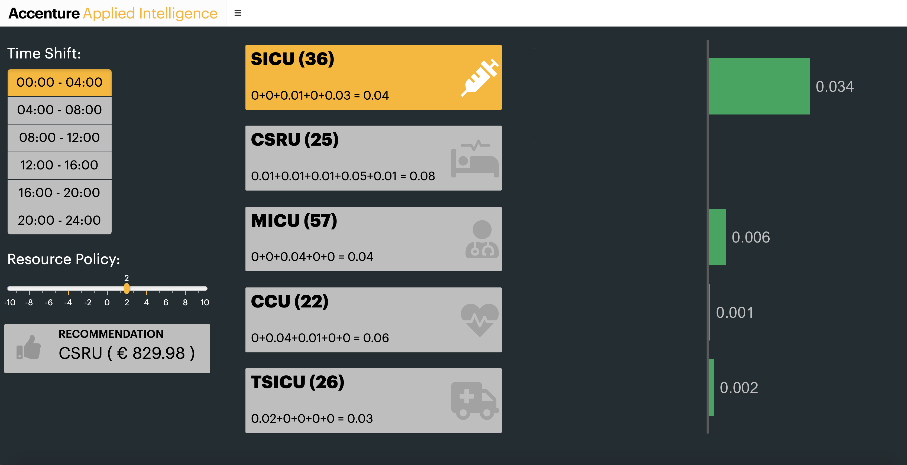

# Baysesian Hospital - Outflow Application (UI)

This folder contains a [Shiny App](https://rstudio.github.io/shinydashboard/) to interact with the empirical model. The model illustrates the effect of a chosen resource policy on the intensive care units outflow and recommends the best unit to apply the given resource policy.

To run the application, follow the steps below:

1. Make sure you have [R](https://cran.r-project.org/doc/manuals/r-release/R-admin.html) installed *(a pretty important step in this process)* and [RStudio](https://www.rstudio.com/products/rstudio/download/)

2. Through your favourite R interface, be sure you `install.packages` for both shiny and shinydashboard along with all the packages found in the `global.R` script. This process has been automated in the `global.R` script but should be validated.

3. Clone this repo

4.  Make sure your current working directory is set to the base level of this repo and run `shinyApp()` in your console, or click the `Run App` button in RStudio.

5. You should see the following:

# Application Tutorial  

At this current point in time the net economic effect is simply the net outflow multiplied by €10 000. This can be easily modified in the `global.R` script (line 19). 
