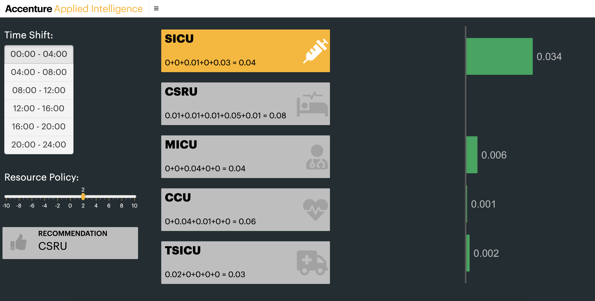
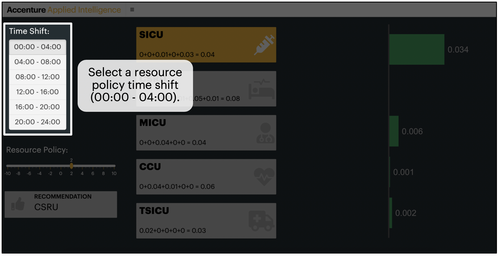
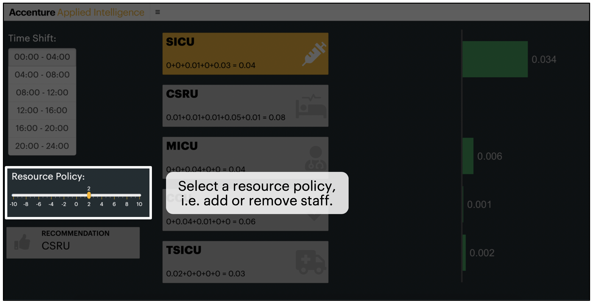
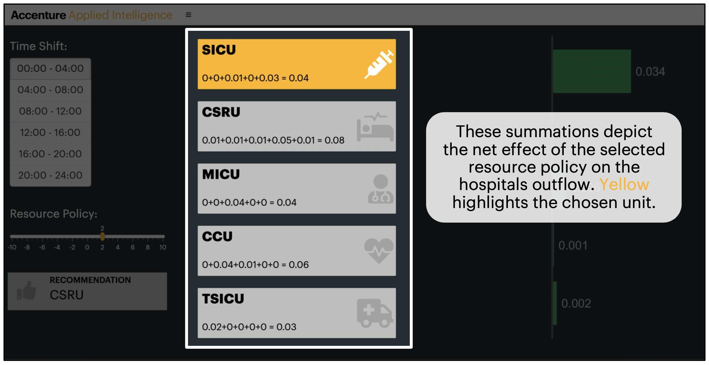
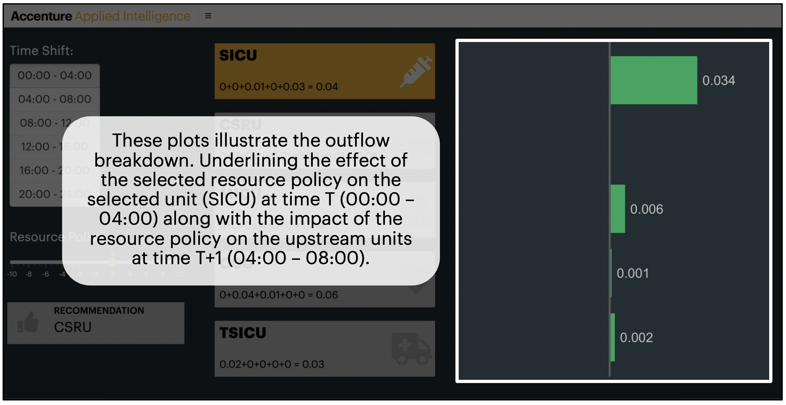
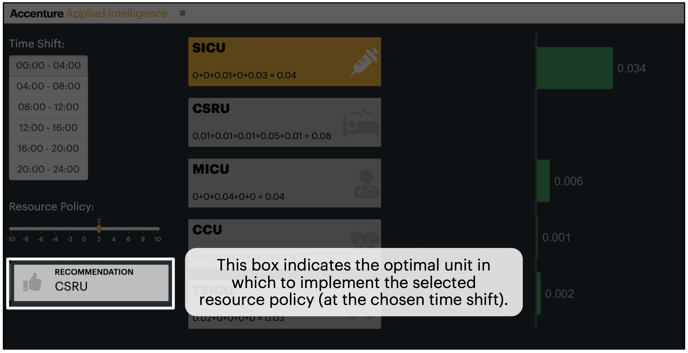

# Baysesian Hospital - Outflow Application (UI)

The outflow_app folder contains a [Shiny App](https://rstudio.github.io/shinydashboard/) to interact with the empirical model that illustrates the effect of a chosen resource policy on the intesive care units outflow and reccomends the best unit to apply given resource policy.

To run the appliction follow the steps below:

1. Make sure you have [R](https://cran.r-project.org/doc/manuals/r-release/R-admin.html) installed *(Pretty important step in this process)*

2. Through your favorite R interface, be sure you `install.packages` for both shiny and shinydashboard along with all the packages found in the `global.R` script. This process has been automated in the `global.R` script but should be validated.

3. Clone this repo

4.  Make sure your current working directory is set to the base level of this repo and run `shinyApp()` in your console, or click the `Run App` button in RStudio.

5. You should see this:

# Application Tutorial  

